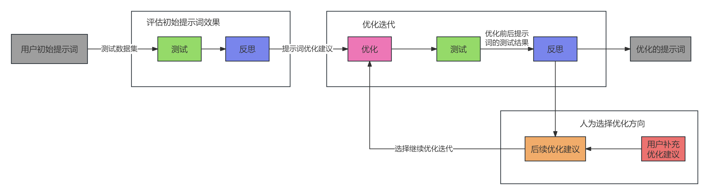

# Prompt Optimizer

## 项目简介

Prompt Optimizer 是一个专门用于优化大语言模型提示词的工具。它通过迭代评估和优化过程，帮助用户提升提示词的效果，使模型输出更符合预期。

## 项目目标

1. 自动化提示词优化过程
2. 提供客观的评估标准
3. 生成可执行的优化建议
4. 支持多种任务类型的提示词优化
5. 提供详细的优化过程记录

## 实现方案

### 技术方案流程



提示词优化过程分为以下几个主要阶段：

1. **初始评估阶段**
   - 输入：用户初始提示词 + 测试数据集
   - 进行初始测试评估
   - 生成反思报告和优化建议

2. **优化迭代阶段**
   - 基于反思结果生成优化建议
   - 执行提示词优化
   - 进行优化后的测试评估
   - 生成新的反思报告

3. **人工干预阶段**
   - 分析优化效果
   - 收集用户补充建议
   - 生成后续优化方向

### 核心功能

1. **提示词评估**
   - 使用测试数据集评估提示词效果
   - 计算准确率等评估指标
   - 分析成功和失败的案例

2. **提示词优化**
   - 基于评估结果生成优化建议
   - 根据优化建议改进提示词
   - 保持提示词的结构化和专业性

3. **迭代优化**
   - 支持多轮优化过程
   - 记录优化历史
   - 追踪性能提升

### 技术特点

1. **模块化设计**
   - 核心优化器模块
   - 评估函数接口
   - 提示词模板系统

2. **灵活配置**
   - 支持多种LLM模型
   - 可自定义评估标准
   - 可扩展的测试数据集

3. **详细记录**
   - 优化过程追踪
   - 性能指标统计
   - 资源消耗监控

## 项目结构

```
prompt-optimizer/
├── optimizer/                 # 核心优化器模块
│   ├── core/                 # 核心功能实现--提示词优化器
│   │   └── prompt_optimizer.py
│   └── prompts/              # 反思和优化的提示词模板
│       └── system_prompts.py
├── llm/                      # LLM接口模块
│   ├── llm_config.py
│   └── llm.py
├── frontend/                 # 前端项目
│   ├── src/                 # 源代码
│   ├── public/             # 静态资源
│   └── package.json        # 项目依赖配置
├── api/                     # 后端API服务
│   └── main.py             # FastAPI主程序
├── examples/                # 示例代码
│   ├── discriminative_task/ # 判别式任务示例
│   │   ├── optimizer_example.py
│   │   └── prompts/
│   └── generative_task/     # 生成式任务示例
├── results/                 # 优化结果输出
└── README.md
```

## 后端API接口

### 1. 优化提示词接口

- **接口地址**: `/api/optimize`
- **请求方法**: POST
- **请求参数**:
  ```json
  {
    "initial_prompt": "初始提示词",
    "success_experience": "成功经验（可选）",
    "optimize_suggestion": "优化建议（可选）",
    "test_accuracy": 0.85
  }
  ```
- **响应参数**:
  ```json
  {
    "optimized_prompt": "优化后的提示词",
    "success_experience": "优化后的成功经验",
    "optimize_suggestion": "优化后的优化建议",
    "test_accuracy": 0.92,
    "execution_time": "执行时间",
    "total_tokens": "消耗的Token数"
  }
  ```

## 前端项目

### 1. 环境要求

- Node.js >= 16.0.0
- npm >= 7.0.0

### 2. 安装依赖

```bash
# 进入前端项目目录
cd frontend

# 安装依赖
npm install
```

### 3. 开发环境运行

```bash
# 启动开发服务器
npm run serve
```

### 4. 生产环境构建

```bash
# 构建生产版本
npm run build
```

## 完整项目启动步骤

1. **启动后端服务**

```bash
# 进入项目根目录
cd prompt-optimizer

# 创建并激活虚拟环境
conda create --name prompt_optimizer python=3.10
conda activate prompt_optimizer

# 安装后端依赖
pip install -r requirements.txt

# 启动后端服务
cd api
uvicorn main:app --reload --host 0.0.0.0 --port 8000
```

2. **启动前端服务**

```bash
# 新开一个终端，进入前端目录
cd frontend

# 安装前端依赖
npm install

# 启动开发服务器
npm run dev
```

3. **访问应用**

- 前端页面: http://localhost:5173
- 后端API文档: http://localhost:8000/docs

## 示例

项目提供了两种类型的示例：
- 判别式任务示例：用于意图识别、槽位提取等任务
- 生成式任务示例：用于文本生成、问答等任务

## 安装教程

### 1. 克隆仓库

```bash
# 使用HTTPS克隆
git https://github.com/songtingze/prompt-optimizer.git

# 或使用SSH克隆
git clone git@github.com:songtingze/prompt-optimizer.git

# 进入项目目录
cd prompt-optimizer
```

### 2. 创建虚拟环境（推荐）

```bash
# 使用conda创建虚拟环境
conda create --name prompt_optimizer python=3.10

# 激活虚拟环境
# Windows
conda activate prompt_optimizer
```

### 3. 安装依赖

```bash
# 安装所有依赖
pip install -r requirements.txt

# 或单独安装主要依赖
pip install pandas openpyxl requests python-dotenv tqdm
```

### 4. 验证安装

```bash
# 运行示例代码
python examples/discriminative_task/optimizer_example.py
```

## 使用说明

1. 准备测试数据集
2. 配置LLM模型参数
3. 定义评估函数
4. 运行优化器
5. 查看优化结果

## 代码示例

以下是一个完整的提示词优化示例，展示了如何使用本项目优化一个时间解析任务的提示词：

```python
from datetime import datetime
from optimizer.core.prompt_optimizer import PromptOptimizer
from llm.llm_config import LLM_Config
import pandas as pd

# 1. 定义评估函数
def example_evaluation_func(response: str, test_case: dict) -> float:
    """
    评估函数示例 - 检查模型输出是否符合预期
    """
    expected = str(test_case.get("expected", ""))
    if response == expected:
        return 1.0
    return 0.0

# 2. 准备测试数据集
def read_questions_and_units(file_path: str, sheet_name: str) -> list:
    """
    从Excel文件读取测试数据
    """
    df = pd.read_excel(file_path, sheet_name=sheet_name)
    return df.apply(lambda row: {
        "input": row["用户问题"],
        "expected": row["起始时间"]
    }, axis=1).tolist()

# 3. 配置LLM模型
optimize_llm_config = LLM_Config(
    model_name="qwen-plus",
    api_key="your-api-key",
    base_url="https://dashscope.aliyuncs.com/compatible-mode/v1"
)

test_llm_config = LLM_Config(
    model_name="qwen2.5-32b-instruct",
    api_key="your-api-key",
    base_url="https://dashscope.aliyuncs.com/compatible-mode/v1"
)

# 4. 创建优化器实例
optimizer = PromptOptimizer(
    optimize_llm_config=optimize_llm_config,
    test_llm_config=test_llm_config
)

# 5. 准备初始提示词
initial_prompt = """
你是一个专业的时间解析助手。你的任务是分析用户输入的时间相关查询，并提取出起始时间。
请按照以下规则处理：
1. 对于"最近X年"的查询，起始时间为当前年份减去X年
2. 对于"这些年"等模糊表达，默认为当前年份减去5年
3. 输出格式必须为YYYYMM格式
"""

# 6. 运行优化
result = optimizer.optimize(
    initial_prompt=initial_prompt,
    test_dataset=test_dataset,
    evaluation_func=example_evaluation_func,
    optimize_suggestion=None  # 首次优化不需要提供建议
)

# 7. 查看优化结果
print(f"优化后的提示词:\n{result['optimize_prompt']}")
print(f"优化过程消耗的token数: {result['total_tokens']}")
print(f"优化过程耗时: {result['execution_time']}秒")

# 8. 保存优化结果
import json
with open("optimization_results.json", "w", encoding="utf-8") as f:
    json.dump(result, f, ensure_ascii=False, indent=2)
```

### 优化过程说明

1. **评估函数**：
   - 根据具体任务定义评估标准
   - 返回0-1之间的分数，表示模型输出的质量

2. **测试数据集**：
   - 包含输入问题和期望输出
   - 支持从Excel等文件读取数据
   - 数据格式为列表，每个元素包含input和expected字段

3. **LLM配置**：
   - 需要配置两个LLM模型
   - optimize_llm：用于生成优化建议和优化提示词
   - test_llm：用于测试提示词效果

4. **优化过程**：
   - 自动评估当前提示词效果
   - 生成优化建议
   - 根据建议优化提示词
   - 记录优化历史和性能指标

5. **结果输出**：
   - 优化后的提示词
   - 优化过程消耗的资源
   - 详细的优化历史记录


## 注意事项

1. 需要配置有效的LLM API密钥
2. 评估函数需要根据具体任务自定义
3. 测试数据集需要包含输入和期望输出
4. 优化过程可能需要多次迭代 